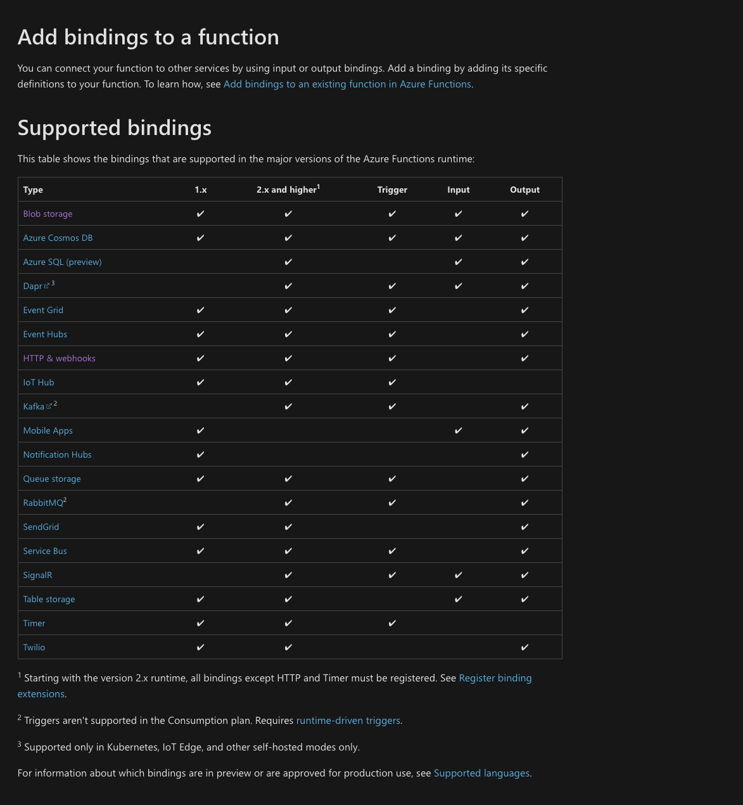
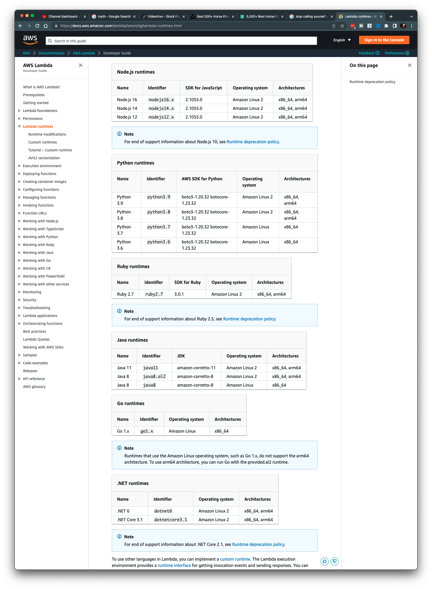

What is a Serverless function or what is Serverless in general?



Serverless functions are a terrible name for what this actually is, but hey, who am I to get in the way of the marketing machines at cloud companies who really like to make things sound like they are better because they don't have complicated stuff in them?

Anyways, Serverless is really an entire class of computing where instead of being charged for servers running all the time, you are instead charged for individual invocations of your functionality. Most of the time you will find that Serverless computing is referred to as Serverless functions because they are light weight, stateless and somewhat short lived.

Where can i find Serverless?

Every cloud provided offers a Serverless solution and there are also many other examples of places where the Serverless idea is used. For the cloud provders, AWS has Lambda, GCP has cloud functions, Azure has Azure functions. Beyond these big names, here are a couple other examples: Netlify, the company known for JAMstack hosting offers Netlify Functions and Cloudlare, the CDN and WAF company, offers Cloudflare Workers.

No matter where you find them or what they’re called, all Serverless offerings have the same things in common:

**Generally they offer a few options on how to envoke them.**

For example, heres a list of the ways Azure functions can be triggered. 

Every cloud provider offers slightly different triggers but the most common one of hitting a certain URL will definitely be available everywhere.

**They can usually be written in a variety of languages.**

Here’s the list of Lambda supported languages. 

Additionally some will support custom runtimes where you can essentially do any language you want. Lets' be honest, these things are really just some sort of container image so its really just a matter of what the provider chooses to let you do.

And finally, for each type of trigger they support, they will provide specific instructions on what your literal function should look like when you write it. when your function is invoked certain arguments will be passed so you can do whatever you need to do.

**My take on Serverless:**

At the end of the day, Serverless functions are not going to replace traditional hosted computing whether it be VMs or containerized applications managed by orchestration platforms. Instead, they, like any other cloud computing tool, have places where they perform the best. These include handling background tasks that are triggered by events or handling data processing that comes in large bursts and you wouldn’t want to have a server running 24/7 doing nothing most of the time.

But, as usual, the cloud providers actually give you a ton of good use cases because they make a ton of tools that can trigger Serverless functions when something changes. Those use cases are a great fit and thats why they’ve made custom triggers for those use cases.